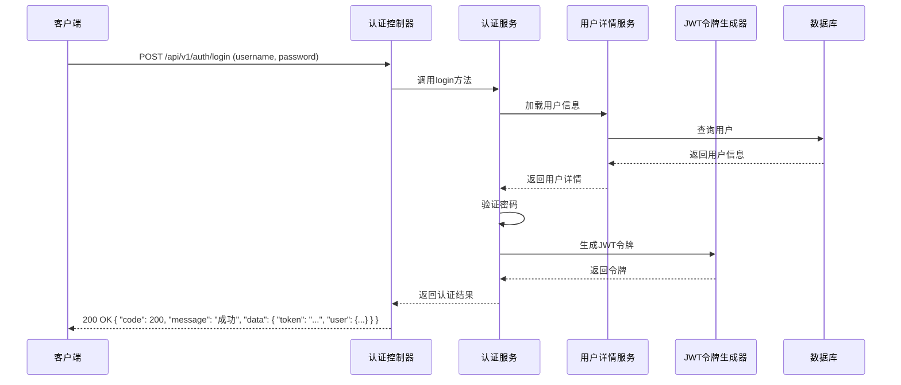
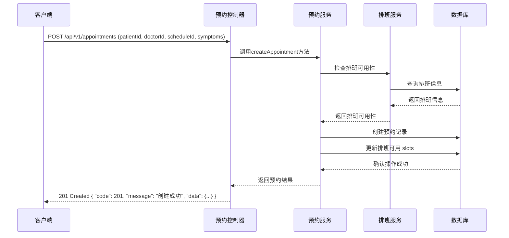

# 智能挂号预约系统 架构设计

## 1. 系统架构概述

智能挂号预约系统采用分层架构设计，遵循 RESTful API 设计原则，使用 Spring Boot 框架实现。系统分为前端和后端两部分，后端提供 RESTful API 接口，前端通过调用这些接口实现业务逻辑。

### 1.1 技术栈选择

- **后端框架**：Spring Boot 3.0+
- **数据库**：MySQL 8.0+
- **认证方案**：JWT (JSON Web Token)
- **ORM 框架**：Spring Data JPA
- **API 文档**：Swagger 3.0
- **安全框架**：Spring Security
- **日志框架**：Logback
- **依赖管理**：Maven

## 2. 模块划分

### 2.1 核心模块

1. **认证模块 (Auth)**
   - 负责用户登录、注册、令牌管理
   - 实现 JWT 令牌生成和验证
   - 提供令牌刷新功能

2. **用户模块 (User)**
   - 管理用户信息
   - 处理用户注册、更新、删除等操作
   - 支持不同角色的用户管理

3. **科室模块 (Department)**
   - 管理医院科室信息
   - 提供科室列表、详情查询
   - 支持科室的增删改查

4. **医生模块 (Doctor)**
   - 管理医生信息
   - 关联科室和用户信息
   - 提供医生列表、详情查询

5. **排班模块 (Schedule)**
   - 管理医生排班信息
   - 处理排班的创建、更新、删除
   - 提供排班查询功能

6. **预约模块 (Appointment)**
   - 管理患者预约信息
   - 处理预约的创建、更新、取消
   - 提供预约查询和状态管理

### 2.2 支撑模块

1. **配置模块 (Config)**
   - 系统配置管理
   - 安全配置
   - JWT 配置
   - Swagger 配置

2. **安全模块 (Security)**
   - 认证和授权
   - 权限管理
   - 防攻击措施

3. **异常处理模块 (Exception)**
   - 全局异常处理
   - 业务异常定义
   - 错误码管理

4. **工具模块 (Util)**
   - 通用工具类
   - 日期工具
   - 加密工具
   - 验证工具

5. **中间件模块 (Middleware)**
   - 限流中间件
   - 日志中间件
   - 跨域中间件

## 3. 目录结构

```
src/
├── main/
│   ├── java/
│   │   └── com/
│   │       └── exclusive/
│   │           └── blank/
│   │               ├── SmartRegistrationApplication.java  # 应用主类
│   │               ├── config/  # 配置模块
│   │               │   ├── SecurityConfig.java  # 安全配置
│   │               │   ├── JwtConfig.java  # JWT 配置
│   │               │   └── SwaggerConfig.java  # Swagger 配置
│   │               ├── controller/  # 控制器层
│   │               │   ├── AuthController.java  # 认证控制器
│   │               │   ├── UserController.java  # 用户控制器
│   │               │   ├── DepartmentController.java  # 科室控制器
│   │               │   ├── DoctorController.java  # 医生控制器
│   │               │   ├── ScheduleController.java  # 排班控制器
│   │               │   └── AppointmentController.java  # 预约控制器
│   │               ├── service/  # 服务层
│   │               │   ├── AuthService.java  # 认证服务
│   │               │   ├── UserService.java  # 用户服务
│   │               │   ├── DepartmentService.java  # 科室服务
│   │               │   ├── DoctorService.java  # 医生服务
│   │               │   ├── ScheduleService.java  # 排班服务
│   │               │   └── AppointmentService.java  # 预约服务
│   │               ├── repository/  # 数据访问层
│   │               │   ├── UserRepository.java  # 用户数据访问
│   │               │   ├── DepartmentRepository.java  # 科室数据访问
│   │               │   ├── DoctorRepository.java  # 医生数据访问
│   │               │   ├── ScheduleRepository.java  # 排班数据访问
│   │               │   └── AppointmentRepository.java  # 预约数据访问
│   │               ├── model/  # 数据模型
│   │               │   ├── User.java  # 用户模型
│   │               │   ├── Department.java  # 科室模型
│   │               │   ├── Doctor.java  # 医生模型
│   │               │   ├── Schedule.java  # 排班模型
│   │               │   └── Appointment.java  # 预约模型
│   │               ├── dto/  # 数据传输对象
│   │               │   ├── LoginRequest.java  # 登录请求
│   │               │   ├── RegisterRequest.java  # 注册请求
│   │               │   ├── UserResponse.java  # 用户响应
│   │               │   ├── DoctorResponse.java  # 医生响应
│   │               │   ├── AppointmentRequest.java  # 预约请求
│   │               │   └── AppointmentResponse.java  # 预约响应
│   │               ├── exception/  # 异常处理
│   │               │   ├── GlobalExceptionHandler.java  # 全局异常处理器
│   │               │   ├── BusinessException.java  # 业务异常
│   │               │   └── ErrorCode.java  # 错误码
│   │               ├── security/  # 安全模块
│   │               │   ├── JwtTokenProvider.java  # JWT 令牌生成器
│   │               │   ├── JwtAuthenticationFilter.java  # JWT 认证过滤器
│   │               │   └── CustomUserDetailsService.java  # 自定义用户详情服务
│   │               ├── util/  # 工具类
│   │               │   ├── DateUtil.java  # 日期工具
│   │               │   ├── EncryptionUtil.java  # 加密工具
│   │               │   └── ValidationUtil.java  # 验证工具
│   │               └── middleware/  # 中间件
│   │                   ├── RateLimitMiddleware.java  # 限流中间件
│   │                   └── LoggingMiddleware.java  # 日志中间件
│   └── resources/
│       ├── application.yml  # 主配置文件
│       └── application-dev.yml  # 开发环境配置
└── test/
    └── java/
        └── com/
            └── exclusive/
                └── blank/
                    ├── controller/  # 控制器测试
                    ├── service/  # 服务测试
                    └── repository/  # 数据访问测试
```

## 4. 核心流程图

### 4.1 用户认证流程



### 4.2 预约创建流程



## 5. 安全认证方案

### 5.1 JWT 令牌认证

- **令牌结构**：
  - Header：包含令牌类型和签名算法
  - Payload：包含用户ID、角色、过期时间等信息
  - Signature：使用密钥签名，确保令牌完整性

- **令牌生成**：
  - 使用 `JwtTokenProvider` 生成令牌
  - 令牌有效期设置为 24 小时
  - 包含用户 ID、角色等信息

- **令牌验证**：
  - 使用 `JwtAuthenticationFilter` 验证令牌
  - 检查令牌有效性、过期时间
  - 解析用户信息，设置到安全上下文

- **令牌刷新**：
  - 提供 `/api/v1/auth/refresh` 接口
  - 使用刷新令牌获取新的访问令牌

### 5.2 RBAC 权限管理

- **角色定义**：
  - ADMIN：管理员，拥有所有权限
  - DOCTOR：医生，可管理自己的排班和查看患者预约
  - PATIENT：患者，可预约、查看自己的预约记录

- **权限控制**：
  - 使用 Spring Security 的 `@PreAuthorize` 注解
  - 基于角色的访问控制
  - 细粒度权限管理到接口级别

- **权限配置**：
  - 在 `SecurityConfig` 中配置权限规则
  - 支持动态权限分配

### 5.3 数据加密传输

- **HTTPS 协议**：
  - 强制使用 HTTPS 协议
  - TLS 1.2 及以上版本
  - 定期更新 SSL 证书

- **敏感信息保护**：
  - 密码使用 BCrypt 哈希存储
  - 敏感数据加密传输
  - 防止敏感信息泄露

### 5.4 防攻击措施

- **防 SQL 注入**：
  - 使用参数化查询
  - 避免直接拼接 SQL 语句

- **XSS 防护**：
  - 输入验证
  - 输出编码
  - 防止恶意脚本注入

- **CSRF 防护**：
  - 使用 CSRF 令牌
  - 验证请求来源

- **速率限制**：
  - 实现 `RateLimitMiddleware`
  - 防止暴力攻击
  - 限制 API 调用频率

- **输入验证**：
  - 使用 JSR-303 验证注解
  - 对所有输入参数进行严格验证

## 6. 部署与扩展性

### 6.1 部署方案

- **容器化部署**：
  - 使用 Docker 容器化
  - 支持 Kubernetes 编排

- **环境配置**：
  - 开发环境：`application-dev.properties`
  - 测试环境：`application-test.properties`
  - 生产环境：`application-prod.properties`

### 6.2 扩展性设计

- **模块化设计**：
  - 松耦合架构
  - 易于添加新功能
  - 支持插件式开发

- **水平扩展**：
  - 无状态设计
  - 支持负载均衡
  - 可根据流量动态扩容

- **微服务架构**：
  - 可拆分核心模块为独立微服务
  - 使用服务注册与发现
  - 支持分布式部署

## 7. 监控与维护

### 7.1 监控方案

- **日志监控**：
  - 集中式日志管理
  - 关键操作日志记录
  - 异常日志告警

- **性能监控**：
  - API 响应时间监控
  - 数据库性能监控
  - 系统资源使用监控

- **健康检查**：
  - 提供健康检查端点
  - 定期检查系统状态
  - 自动故障检测

### 7.2 维护策略

- **版本管理**：
  - 语义化版本控制
  - 版本发布计划
  - 回滚机制

- **备份与恢复**：
  - 定期数据备份
  - 灾难恢复计划
  - 数据一致性检查

- **安全更新**：
  - 定期安全扫描
  - 漏洞修复
  - 安全补丁管理
